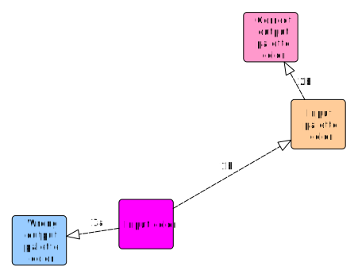
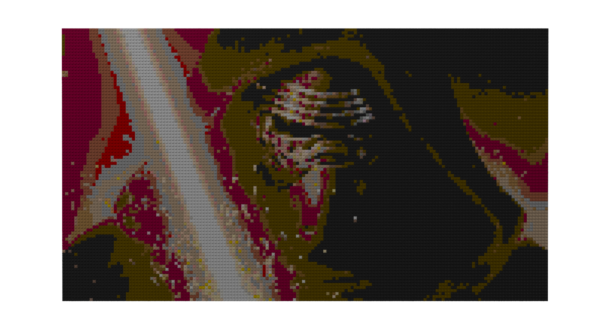
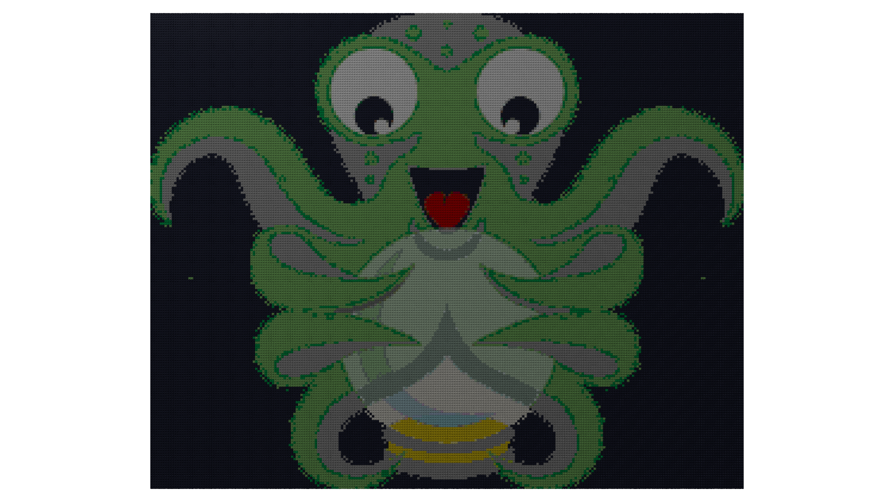
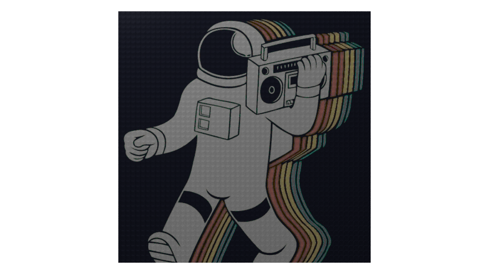

# LDraw-PixelArt-Generator

This little command line script provides a tool that creates a pixel art for bricks like [LEGO](https://www.lego.com/)®. It creates [LDraw](http://www.ldraw.org)&trade; files or output streams for other tools like [LeoCAD](https://www.leocad.org/).

## Dependencies ##
The following libraries must be installed:
+ [PyQt5](https://pypi.org/project/PyQt5/)
+ [pandas](https://pandas.pydata.org/)
+ [numpy](https://numpy.org/)

## Usage ##
The **simplest use** works on *only* **two commands**. This required commands are `src_image` and `input_palette`. However, it is recommended that you set the `size` command for *large* input images, otherwise the calculation can take time.
> The examples below in section `PixelArt examples` give an idea of ​​the expected execution times.

Feel free to use the help with `--help`.

### Usage example 1 ###

```
$ ./ldraw_pixelart.py --src_image images.jpg --input_palette colors.csv > pixelart.ldr
```

### Usage example 2 ###

```
$ ./ldraw_pixelart.py --src_image images.jpg --input_palette ldraw_colors.csv --size 32 32 > pixelart.ldr
```

### Usage example 3 ###

```
$ ./ldraw_pixelart.py --src_image images.jpg --input_palette ldraw_colors.csv --size 32 32 --ldr_path pixelart.ldr
```

## How it works ##

First the image is loaded. The image is then scaled to the specified size. The scaled image is quantized using the configured input color palette. Quantization is a pixel-by-pixel replacement for colors with an [euclidean distance](https://en.wikipedia.org/wiki/Euclidean_distance). This quantized image can also quantize with a second color palette. This quantized image can also be quantized using a second color palette. Why? Sometimes the shortest distance colors are not the best solution. The first color palette defines the source color in a first *direction* and the second palette defines the final color.



The last picture is passed to the Pixel Art module. This generator creates a rectangle or a rounded 1x1 plate *brick* for each pixel. Finally, the tool creates the output stream or file.

## Annotation ##

The source code is poorly tested (*three day hack*) and could crash. I take no responsibility and give no guarantee for the use of the program.

## Issues ##

+ Multithreaded quantization doesn't work
+ No multithreaded string generation
+ No anti aliasing filter
+ Maybe a clipping problem?

---
---

## PixelArt examples ##

All pixel arts was rendered with Intel® Core&trade; i7-7500U and the color palette `ldraw_colors.csv`.


Name: Kylo Ren, size: 160x90p, elapsed time: 3s


Name: OctoPrint Logo, size: 249x200p, elapsed time: 15s


Name: Astronaut, size: 521x568p, elapsed time: 1min 22s
